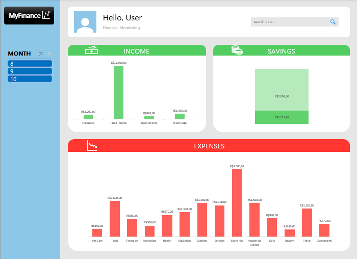

# Project: Interactive Expense Spreadsheet 💸

[PORTUGUES VERSION](https://github.com/brunovalerin/expense-spreadsheet-with-interactive-dashboard/tree/main)

## 📒 Description
Responsive charts generated in Excel from expense spreadsheets, including customizable dashboards and filters for a better user experience.

## 🧐 Creation Process
📁 The raw data received was organized as a table, number formats were cataloged and conversion errors were corrected.

✂️ The content obtained was separated and worked on through filters and formulas, resulting in charts that were relevant to the user. 

📊 The charts were positioned in an individual tab, working on a more user-friendly layout and with responsive filters.

#

<a href="https://github.com/brunovalerin/expense-spreadsheet-with-interactive-dashboard/blob/main/Output/Planilha_EN_US.xlsx" title="View PDF now"> DOWNLOAD THE SPREADSHEET HERE!</a>

