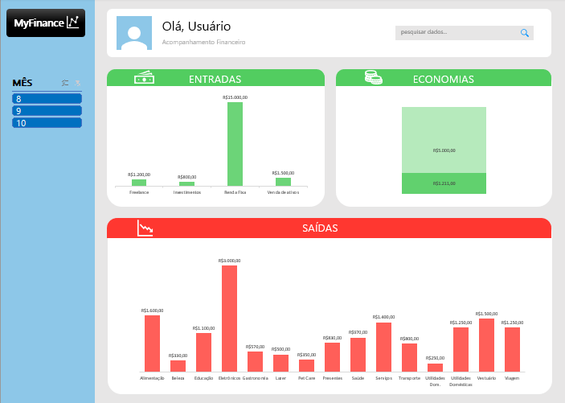

# Projeto: Planilha de Gastos Interativa 💸

[ENGLISH VERSION](https://github.com/brunovalerin/expense-spreadsheet-with-interactive-dashboard/tree/en_us)

## 📒 Descrição
Gráficos responsivos gerados no Excel a partir de planilha de gastos, incluindo dashboards customizáveis e filtros para melhor experiência do usuário.

## 🧐 Processo de Criação
📁 Os dados recebidos de forma bruta foram organizados como tabela, sendo catalogados formatos de números e corrigidos erros de conversão.

✂️ O conteúdo obtido foi separado e trabalhado através de filtros e fórmulas, resultando em graficos que fossem relevantes ao usuário. 

📊 Os graficos foram posicionados em aba individual, trabalhando um layout mais amigável e com filtros responsivos.

#

<a href="https://github.com/brunovalerin/expense-spreadsheet-with-interactive-dashboard/blob/main/Output/Planilha_PT_BR.xlsx" title="View PDF now"> BAIXE A PLANILHA AQUI!</a>

